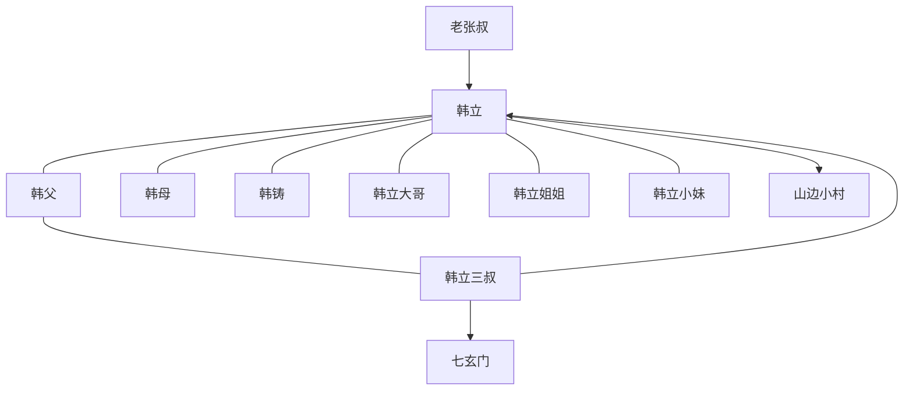

# 第一卷第一章人物关系总览

## 核心判断

第一章的关系网并不复杂，但功能非常明确：先用家庭关系稳住韩立的凡人根基，再用三叔和七玄门把这张关系网向更大世界打开一个缺口。

## 人物关系图

## 关系拆解

### 1. 家庭关系

- [韩立](../01-人物/韩立.md) 处于韩家核心关系网中
- [韩父](../01-人物/韩父.md) 与 [韩母](../01-人物/韩母.md) 代表家庭现实
- [韩铸](../01-人物/韩铸.md)、[韩立大哥](../01-人物/韩立大哥.md)、[韩立姐姐](../01-人物/韩立姐姐.md)、[韩立小妹](../01-人物/韩立小妹.md) 共同构成“多子女、贫寒但紧密”的家庭结构

### 2. 影响韩立命运的关键关系

- [老张叔](../01-人物/老张叔.md) 提供的是观念影响
  他让韩立知道村外还有更大的世界。
- [韩立三叔](../01-人物/韩立三叔.md) 提供的是现实通道
  他把韩立真正送到可能改变命运的路径上。
- [七玄门](../02-组织/七玄门.md) 提供的是结构性机会
  它代表一个超出村庄逻辑的新秩序。

### 3. 当前最重要的三条线

- 亲情线：韩立对家庭有牵挂，尤其疼爱妹妹
- 向外线：韩立始终想离开小村看看外面的世界
- 转折线：三叔带来的七玄门机会，将“愿望”变成“行动”

## 结论

如果把第一章看成关系网络，它的中心不是冲突，而是“牵引”：

- 家庭把韩立留在凡人世界
- 欲望把韩立推向外部世界
- 三叔与七玄门把这股推动力具体化

这就是韩立修仙故事的真正起点。

## 来源

- `../resources/第一卷 七玄门风云/0001第一章 山边小村.txt`

