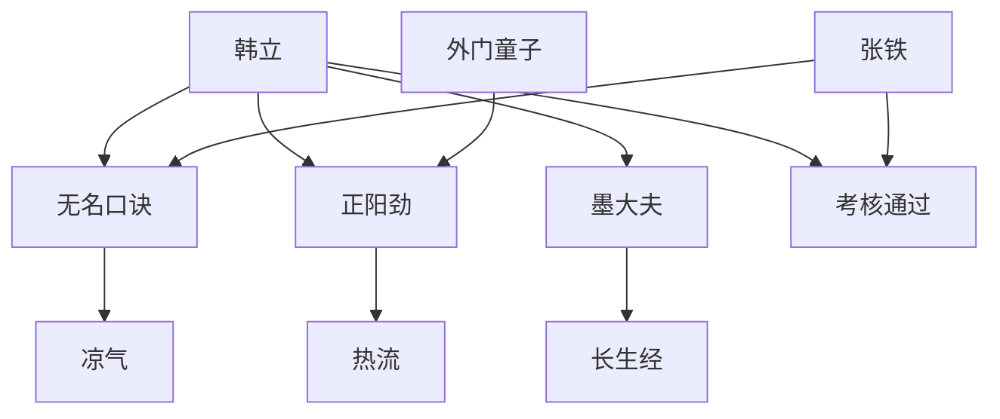

# 第一卷第七章关系总览

## 核心判断

第七章是韩立修炼的"苦行期"回顾。本章以现在的视角回述半年修炼，核心信息是：无名口诀极难修炼（三个月才一丝凉气），韩立曾想放弃，但因张铁更差而重拾信心。二人均通过考核，成为正式弟子。

## 关系图

## 关系拆解

### 1. 无名口诀的真实难度

- 韩立苦修三个月才产生一丝微凉能量流，"若有若无，不仔细内视根本发现不了"
- 与同批童子修炼[正阳劲](../03-功法/正阳劲.md)的效果天差地别：对方能拳断碗口粗小树、跳一丈多高，韩立"几乎没有大的改变"
- 韩立一度打算放弃，"做好了下山的打算"
- 得知[张铁](../01-人物/张铁.md)修炼后"体内竟然未有丝毫变化"，韩立才重拾信心

### 2. 韩立的动力转变

- 此前"希望考核不过关以便早日回家"
- 从其他人嘴里知道内门和外门待遇差别后，"把蒙混过日子成为外门弟子好回家的念头彻底丢掉了"
- 动力来源：银子和改善家庭生活——"每多领一分银子，家里父母兄妹的生活就能多好一分"
- 修炼方式："比以前更加努力，更加疯狂"，"每一刻钟的时间都用来打坐修炼"

### 3. 无名口诀的异常之处

- 产生的不是热流而是"凉气"，与七玄门所有内功完全不同
- "分为数层"，韩立只有第一层修炼法诀
- 修炼后的隐性效果："精神比以前旺盛了许多，胃口也比上山前好了许多"
- 修炼有痛苦——经脉会破裂，"生不如死"

### 4. 墨大夫的不管不问

- 传授口诀后对二人"不管不问"，"好像已经完全忘掉了两人的存在"
- 终日苦读《长生经》，"想和河里的乌龟一样老而不死，活个成千上万年"
- 韩立和张铁识字后才知道书名，此前以为他"苦读书改考秀才了"

## 本章关系推进

- 第六章：韩立得到无名口诀，开始修炼
- 第七章：韩立经历了极艰难的修炼，但最终通过考核

第七章回答的是"无名口诀有多难修"。它极难——比正阳劲慢得多，但韩立在极度困难下仍坚持下来。这种"拼命修炼"的狠劲，是他在第六章炼骨崖上展现的同一股气，只是这次用在了内功修炼上。

## 来源

- `../resources/第一卷 七玄门风云/0007第七章 修炼难.txt`
