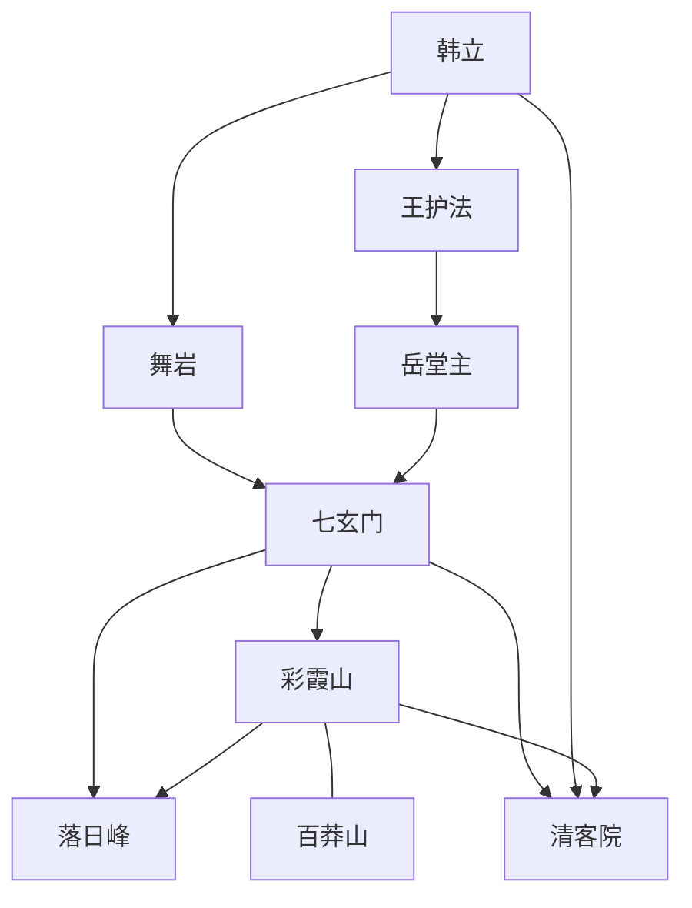

# 第一卷第三章关系总览

## 核心判断

第三章完成了韩立从"路上"到"门派大门"的空间转移。本章的核心不是新增大量人物，而是展开七玄门总门的物理场域和组织架构。考生分三类人的设定，建立了门派内部的阶层底色。

## 关系图

## 关系拆解

### 1. 考生阶层：三类人结构

- [舞岩](../01-人物/舞岩.md) 类：有钱有势、会功夫，靠关系破例，自然成为车内的主导者
- 簇拥舞岩的城镇考生：出身城镇，善于察颜观色、逐利而行
- [韩立](../01-人物/韩立.md) 类：来自穷乡僻壤，畏手畏脚、人数最少

三类人结构预示了门派内部的阶层分化，韩立处于最不利的位置。

### 2. 七玄门内部等级链

- [王护法](../01-人物/王护法.md) 在路上的跋扈态度 vs 在[岳堂主](../01-人物/岳堂主.md)面前的恭敬媚色，形成鲜明对比
- 岳堂主作为总门堂主，直接指挥选拔流程，地位高于护法
- 这反映七玄门内部等级森严，层级分明

### 3. 七玄门的物理场域

- [彩霞山](../05-场景/彩霞山.md) 作为门派驻地，方圆十几里、十几个山峰，展现规模
- [落日峰](../05-场景/落日峰.md) 的十三处哨卡，体现防御严密
- [清客院](../05-场景/清客院.md) 的简陋土房，显示考生接待的低规格

### 4. 门规暗示

- 岳堂主"没过关的及早下山，免得犯了山上规矩"，暗示门规严厉
- 王护法"可以看得出在门内熟人很多，人缘不错"，说明门派内部有社交网络

## 本章关系推进

- 第一章：韩立是否离开家
- 第二章：韩立由谁接入七玄门
- 第三章：韩立面对的七玄门是什么样的结构

第三章回答的是"目标场域"的问题。七玄门不再是概念，而成为有具体空间、等级、人员和规矩的现实组织。

## 来源

- `../resources/第一卷 七玄门风云/0003第三章 七玄门.txt`
