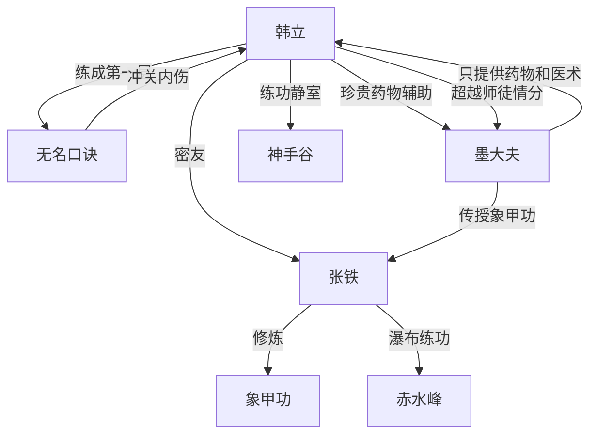

# 第一卷第九章关系总览

## 核心判断

第九章是韩立成为亲传弟子后的"待遇回顾"章。本章以韩立练功出定的视角，回述了墨大夫对韩立的超规格照顾——练功静室、珍贵药物、全力医治——以及对张铁的象甲功传授。两人行走完全不同的培养路线，且墨大夫对韩立的关心持续超出正常师徒范畴。

## 关系图

## 关系拆解

### 1. 韩立的超规格待遇

- **练功静室**：花岗岩凿制、青石门，只有门主、长老、堂主等才有，七绝堂核心弟子也不能随便拥有——墨大夫"硬是叫几位长老同意"才建成，韩立是唯一的普通弟子使用者
- **药物辅助**：每日服用几种不同药物，用不知名药草做汤汁浸泡身子，墨大夫用这些药时脸上流露出"难舍的神态"——说明药物极其珍贵
- **全力医治**：韩立冲关内伤后，墨大夫"坐卧不宁""比韩立自己还紧张"，"舍得用好药"
- 韩立对此"心头无端端的有几丝坎坷不安"，"远远超出普通师徒间应有的情分"

### 2. 无名口诀第一层完成的代价

- 在外力（药物）辅助下韩立才成功冲关
- 冲关时几条经脉差点破裂，受了"不轻不重"的内伤
- 这是第七章中"经脉破裂""生不如死"的具体体现——口诀第一层的完成就要付出这种代价

### 3. 张铁与象甲功

- 象甲功是江湖上极罕见的九层武功，前三层易练、四至六层需承受极大痛苦、七至九层一路平坦
- 第九层可刀枪不入、水火不近、力能生撕虎豹
- 创制者因"天生没有疼痛知觉"才能练到第九层
- 张铁两个月练到第一层顶峰，在瀑布下练功准备突破第二层
- 墨大夫"原原本本将此功的利弊告诉了张铁"，与对韩立只教无名口诀不教其他功夫的态度形成对比

### 4. 两条不同的培养路线

- **韩立路线**：无名口诀 + 大量珍贵药物辅助 + 医术传授（墨大夫毫无保留）
- **张铁路线**：象甲功 + 正常指导
- 墨大夫对韩立"不教其他功夫"，但医术方面"毫无保留""有问必答""允许随意翻看所有医术书籍"
- 两人分别拥有私人小屋，搬出了原来共住的屋子

### 5. 韩立与张铁的密友关系

- "在这大半年内，因为脾气相投，外加上出身比较类似，很自然地结成了无话不说的密友"
- 两人虽然走的培养路线不同，但友情稳固

## 本章关系推进

- 第八章：韩立成为亲传弟子，张铁获授新心法
- 第九章：展示两人成为弟子后的实际培养情况——韩立获得超规格待遇，张铁获得象甲功。墨大夫对两人的差异化对待进一步加深了"韩立对墨大夫有某种特殊意义"这一判断

## 来源

- `../resources/第一卷 七玄门风云/0009第九章 象甲功.txt`
