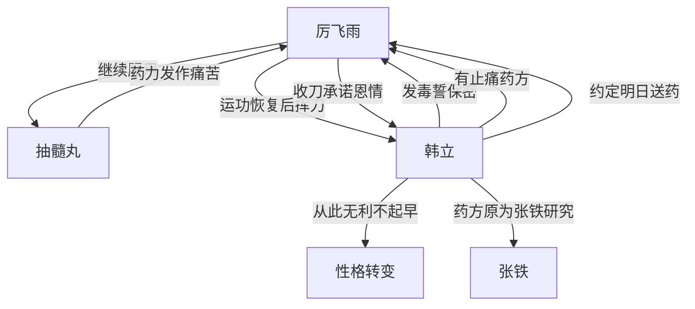

# 第一卷第二十一章关系总览

## 核心判断

第二十一章是韩立性格转变的关键章节——首次救人就差点被杀，从此形成"无利不起早"的处世原则，抛弃了原本的淳朴本性。这是韩立从淳朴少年向精于算计的修仙者转变的第一步。

## 关系图

## 关系拆解

### 1. 厉飞雨的杀意

- 厉飞雨选择继续服用抽髓丸，经历非人痛苦后运功恢复
- 恢复后突然睁眼挥刀架在韩立脖子上
- "给我一个不杀你的理由出来！"
- 韩立平静回应已料到可能被他灭口，但仍选择救人
- 韩立发毒誓保密后，厉飞雨才收刀
- 韩立脖子上被划出一道浅浅血痕

### 2. 韩立的首次性格转变

- 韩立暗自后怕："可够险啊！自己还是考虑得不够周全"
- 下定决心："没有足够的好处和十全的把握，下次决不再出手救人"
- 原文描述：这是韩立首次出手救人的不良后果，直接导致他以后无利不起早的恶习
- 原本还有些淳朴的本性被彻底抛弃，虽然没变成恶人，但也离忠厚善良差了老远

### 3. 厉飞雨的真名与承诺

- 厉飞雨全恢复了神采，报上真名
- 承诺"只要我没死，你有什么事情需要帮忙尽管找我"
- 韩立一针见血指出厉飞雨不可能过得好
- 厉飞雨脸色阴沉，半晌不语

### 4. 止痛药约定

- 韩立有专门为张铁研究的减轻痛苦药方
- 能大幅降低人体对痛苦的知觉，非常有效
- 韩立空闲时专门为张铁研究出来的
- 约定明天午时在神手谷门口送药

## 本章关系推进

- 第二十章：韩立认出抽髓丸，给厉师兄两个选择
- 第二十一章：厉飞雨选择继续服药，韩立差点被杀，"无利不起早"性格从此定型

## 来源

- `../resources/第一卷 七玄门风云/0021第二十一章 止痛药.txt`
