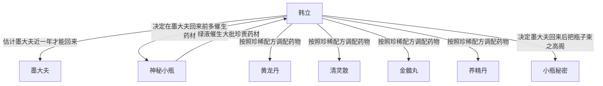

# 第一卷第二十七章关系总览

## 核心判断

第二十七章是韩立大规模配制灵药的章节。韩立在墨大夫回来前在神手谷使用瓶子是安全的，因为山谷只有他一个人。韩立估计墨大夫最少要花近一年光阴才能赶回山里。韩立决定在墨大夫回来之前尽可能多催生珍贵药材，按照知道的珍稀配方来获取药材。韩立在接下来的数月里偷偷用瓶子中的绿液催生了大批珍贵药材，按照配方调配了不少珍稀药物。

## 关系图

## 关系拆解

### 1. 韩立的时间判断

- 韩立知道在墨大夫回来前在神手谷使用瓶子暂时是安全的，因为整个山谷就只有他一个人
- 韩立估计墨大夫要在附近的地方是不可能找到什么好的药材
- 他恐怕要去比较远的地方去寻找，很可能是要去那些人迹罕至的深山老林之处
- 但这样路上一来一回，再加上当中搜寻药材所花费的时间，最少也要花上近一年的光阴才能赶回山里
- 现在离墨大夫下山已经过了近半年，估计他再有六七个月就该回到了七玄门

### 2. 韩立的珍稀药材知识

- 韩立以前在墨大夫那里学习医术的时候，对这些稀有配方大感兴趣
- 他虽然从没奢望过自己能够配制这些珍贵之极的药物，但也把这些配方给记下了不少
- 墨大夫对他学习这些配方的十足劲头也抱着无所谓的态度，只要韩立问起，他就会详详细细地告诉韩立
- 大概墨大夫也认为，这些配方属于那种吃之无味、丢之可惜的鸡肋

### 3. 大规模催生药材

- 韩立做好了一切的打算，也下定了以后秘密收藏好瓶子不再轻易动用的决心
- 在接下来的数月里，韩立偷偷的用瓶子中的绿液，催生了大批的珍贵药材
- 他用这些药材，按照配方调配了不少的珍稀药物
- 在配制过程中也发生了不少次的失败，每次的失败都让韩立肉疼了好久
- 这也不能怪他，这些配方谁都是第一次配制，失败几次是难免的
- 就是墨大夫亲自来配这些药物，也会有一两次的失手

### 4. 配制的珍稀药物

- "黄龙丹""清灵散""金髓丸""养精丹"这些外面难得一见的稀世之药全都放在十几个小瓶内
- 韩立看着这些药瓶，脸上也是喜形于色
- 有了这些灵丹妙药，他别说练成口诀的第四层，就连第五层、第六层也不会费太多的力气就能练成
- "黄龙丹"和"金髓丸"对他练功帮助最大，都有增加功力、脱胎换骨的妙用
- "清灵散"则是世间少有的解毒圣药，能解天下千百种剧毒
- "养精丹"是一种对内外伤都有奇效的灵药

## 本章关系推进

- 第二十六章：韩立完全掌握小瓶使用方法
- 第二十七章：韩立开始大规模催生药材，估计墨大夫再有六七个月就该回七玄门

## 来源

- `../resources/第一卷 七玄门风云/0027第二十七章 配灵药.txt`
