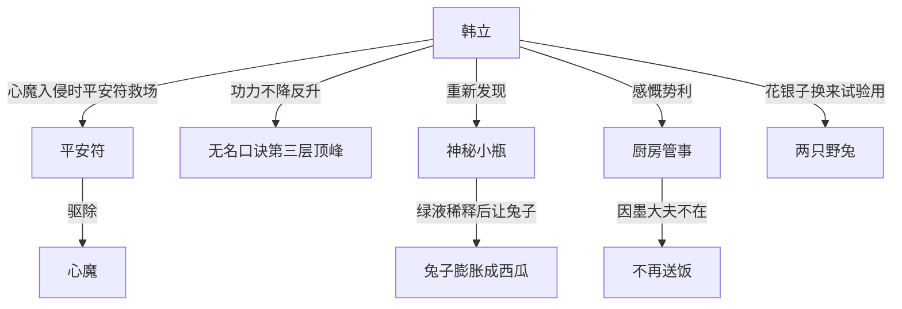

# 第一卷第二十三章关系总览

## 核心判断

第二十三章是韩立第一次主动探索神秘小瓶绿液功效的章节。本章揭示了韩立上章"走火入魔"的真相——实为"心魔入侵"，平安符救了他一命。同时韩立重新开始研究小瓶，用绿液对兔子做活体试验，结果兔子膨胀成西瓜大小，完全出乎意料。

## 关系图

## 关系拆解

### 1. 心魔入侵真相

- 韩立上章的"走火入魔"实为修道之人的"心魔入侵"
- 平安符是韩立父母给的野猪牙平安符，一触就产生清心效果
- 若不是平安符及时驱离心魔，韩立会被心魔侵入元神，操纵躯体狂舞而死
- 这一切都是韩立后来踏上修道之路才知道的
- 心魔事件后韩立功力反而增长，达到无名口诀第三层顶峰

### 2. 平安符的意义

- 平安符在韩立遇到心魔时救了命
- 暗示平安符不只是普通护身符，可能有不凡来历
- 韩立此前一直把平安符和小瓶一起放在皮袋中贴身收藏

### 3. 韩立重新审视小瓶

- 韩立因捡平安符意外重新发现遗忘已久的神秘小瓶
- 以四年后的见识判断小瓶绝对是"世间少有的奇物"
- 决定挖掘小瓶价值，不能让它暗无天日地待在袋子里
- 仔细观察后没有新发现，绿液和四年前并无不同

### 4. 兔子活体试验

- 韩立决定找小动物做活体试验来搞清绿液秘密
- 先让野兔在太阳下暴晒至无精打采、口干舌燥
- 豆粒大小的绿液掺入一碗清水，整碗水变成碧绿色
- 绿液消融到清水中让整碗水都变绿，绿碧意让人从心底涌上凉意
- 兔子喝掉一小半绿水后，一炷香功夫开始急躁蹦跳
- 皮毛下凸起鸡蛋大小疙瘩并布满全身，疙瘩连成一片让身体大上一圈
- 随后身体不断膨胀，越来越鼓，最后被撑成两个圆鼓鼓的大西瓜
- 韩立对此诡异景象感到吃惊——这既不是剧毒也不是灵药，完全出乎意料

### 5. 韩立与厨房管事

- 以前墨大夫在山上时，厨房派人把饭送到神手谷
- 墨大夫不在后，厨房不再送饭上门
- 韩立感慨厨房管事的势利之处，大叹权力的好用
- 韩立花几钱碎银子从厨房管事换来两只活蹦乱跳的灰毛野兔

## 本章关系推进

- 第二十二章：韩立心魔入侵，平安符和小瓶都在皮袋中
- 第二十三章：揭示平安符救场真相，韩立开始主动探索小瓶功效

## 来源

- `../resources/第一卷 七玄门风云/0023第二十三章 试药兔.txt`
