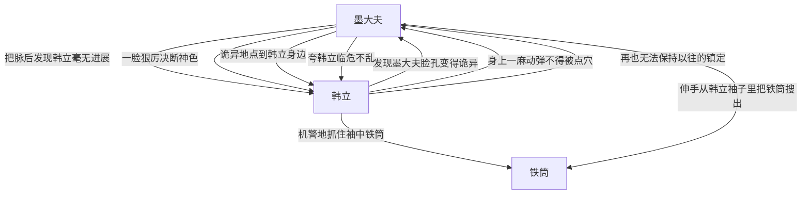

# 第一卷第二十九章关系总览

## 核心判断

第二十九章是韩立和墨大夫冲突全面爆发的章节。墨大夫把脉后发现韩立修炼毫无进展，脸色阴沉。韩立跟着墨大夫进了屋子，发现墨大夫脸孔变得诡异——灰败的脸上隐隐罩上一层淡淡的黑气。墨大夫一改往日死板神情，现出一脸狠厉决断神色。韩立机警地往后退半步，把手缩到袖口里抓住那里的一只铁筒。墨大夫一声低低的嘲语声后，身子诡异地从半躺着变成站立之势，阴阴一笑后身形一晃，整个人仿佛幽灵一样到了韩立身边。韩立脸色大变想举起手臂，但身上一麻动弹不得——墨大夫不知何时点了他的穴道。

## 关系图

## 关系拆解

### 1. 韩立和墨大夫的紧张对峙

- 墨大夫面无表情，双目半睁半闭，一只手牢牢地搭在韩立的手腕上
- 他全部的心神，都集中到了韩立体内的真气强弱上，半晌没说话
- 一盏茶的功夫后，他才深深地出了一口气，似乎把心中的懊恼全都吐了出来
- 眼睛猛然睁开，一缕精光从他浑浊的眼中射了出来，让人不敢对视
- 他脸色阴沉，很明显对韩立不满意，不过仍没有责骂的话语出来
- 他冷漠的摆了摆手，示意韩立跟着他一块走

### 2. 韩立的警觉

- 韩立乖觉的跟在他身后，虽然对一边的神秘人很感兴趣，但知道目前不是自己随意询问的时候
- 进了屋子后，墨大夫有些疲倦的坐到太师椅上，后背紧贴着靠背，半做半躺着
- 神秘人一直紧随着他身后，寸步不离，在他坐下后，就站到了椅子的背后，直直的戳立在那儿，一动不动
- 韩立知道墨大夫心里正在不痛快，也不愿主动开口触对方霉头，就学着神秘人一样，走到屋子的正中间，面朝着墨大夫低着头，识趣的不再乱动，等待着对方开口问话

### 3. 墨大夫的诡异变化

- 过了老半天，还是没人言语，韩立有些奇怪，沉不住气了，悄悄地想抬起头偷看墨大夫一眼
- "想看就看，干吗要偷偷摸摸的？"刚把脖子扬起了一半，墨大夫冷厉的声音传了过来
- 韩立脸上神色没变，可心里却犹如惊涛骇浪，翻滚不停
- 墨大夫脸孔怎么一下子如此诡异，有些灰败的脸上隐隐的罩上了一层淡淡的黑气
- 这黑气像是有生命一般，伸出无数的细小触角，张牙舞爪的在他脸上乱舞着
- 更令韩立心惊的是，墨大夫一改往日的死板神情，现出一脸的狠厉决断神色，正用一种不怀好意的目光在注视着韩立，嘴角还露出几分讥讽的嘲笑之意

### 4. 韩立被制住

- 韩立觉得情况有点不太对劲，几分不安的情绪绕上心头，一丝危险的气息也开始在屋内漫延着
- 他机警地、小心翼翼的往后退了半步，把手缩到袖口里抓住了那里的一只铁筒，把绷紧的神经才放松了一点
- 这时耳边忽然传来了墨大夫一声低低的嘲语声："一点小聪明，也敢拿出来卖弄吗？"
- 墨大夫身子动了，诡异的从半躺着变成了站立之势，阴阴一笑后再身形一晃，整个人仿佛幽灵一样的到了韩立身边，望着韩立"嘿嘿"冷笑着
- 韩立脸色大变，知道不妙，急忙想举起手臂，但身上一麻，动弹不得
- 这时他才看到，对方手指从自己胸前的穴道上拿开
- 真是太快了，自己竟然没有丝毫察觉到对方的出手

### 5. 韩立的应对

- "墨老，您这是要做什么？弟子有什么不对的，您老尽管开口，何必要点住弟子的穴道呢？"韩立这时再也无法再保持以往的镇定，他强笑着对墨大夫说道
- 墨大夫并不言语，只是一只手锤了几下自己的后背，轻咳嗽了一下，一副老太龙钟、弱不禁风的模样
- 可韩立刚刚见过他制住自己的迅猛模样，哪还敢真把他当成一位普通的重病老人，对他的这番做作反而更增加了几分重视
- "墨大夫，您老是什么身份，又何必和弟子一般见识，你解开弟子的穴道，有什么惩罚，弟子一力承担就是了。"韩立又一连说了几句好听、恭维的话语
- 可墨大夫根本不与理会，伸手从他的袖子里把那只铁筒搜了出来，拿在手里，然后用一种嘲笑、蔑视的目光看着他的表演
- 韩立见到这种情形，心一下子沉到了最深处，原本指望用话语打动对方的念头，也彻底的断掉了

## 本章关系推进

- 第二十八章：韩立修炼达到第四层，墨大夫回山谷了
- 第二十九章：韩立和墨大夫冲突全面爆发，韩立被制住

## 来源

- `../resources/第一卷 七玄门风云/0029第二十九章 冲突起.txt`
