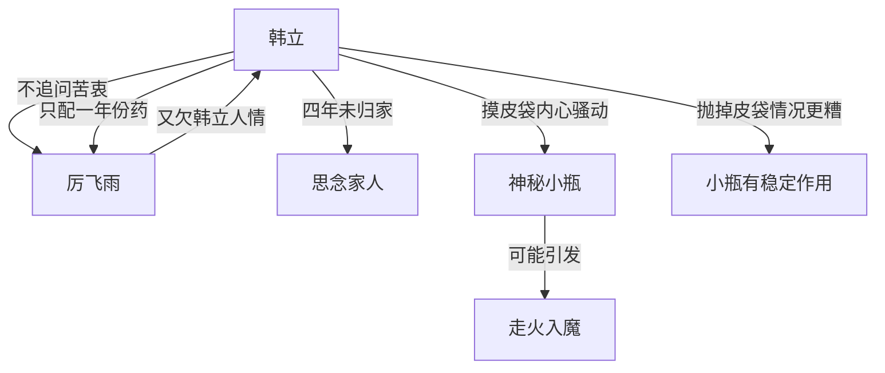

# 第一卷第二十二章关系总览

## 核心判断

第二十二章是韩立修炼生涯中第一次"走火入魔"。本章前半段展示了韩立的精于算计——只配一年份的药让厉飞雨每年都来，后半段韩立思乡情绪引发气血翻滚，疑似走火入魔，而诱因似乎与装有神秘小瓶的皮袋有关。

## 关系图

## 关系拆解

### 1. 韩立的人情投资

- 韩立不追问厉飞雨服用抽髓丸的原因——善解人意，让厉飞雨又欠一个不大不小的人情
- 韩立配好足够一年的止痛药，不是不能多配，而是希望厉飞雨以后每年都来取
- 目的：让厉飞雨不会慢慢忘记这份人情，让他不好拒绝以后的要求
- 厉飞雨武功越来越高，对韩立有帮助的可能性就越大
- 韩立的思维逻辑完全变了——"没有足够的好处和十全的把握，下次决不再出手救人"

### 2. 韩立与家人

- 韩立离家长达四年多，几乎每天苦修无暇想家
- 每月把大部分银子捎回家，每年只收到一封老张叔代笔的平安信
- 大哥已成家立业，二哥说好了新媳妇预计明年操办
- 家里生活因韩立送回的银子而改善
- 家人对韩立的口气越来越客气，像对待陌生人
- 韩立起初害怕这种客气，后来逐渐变平淡，家人形象在心目中逐渐模糊

### 3. 走火入魔

- 傍晚韩立一反常态坐在门前看星空思乡
- 摸皮袋时内心骚动无法平静（以往能得到淡淡满足）
- 体内气血翻滚、修炼出来的古怪能量蠢蠢欲动
- 韩立怀疑是皮袋引起，果断抛远
- 抛掉皮袋后心里更难受、气血翻滚更强烈
- 韩立用充满血丝的眼睛死盯着皮袋

## 本章关系推进

- 第二十一章：韩立"无利不起早"性格定型
- 第二十二章：韩立将这种性格运用到极致（一年份药的人情策略），并首次遭遇走火入魔

## 来源

- `../resources/第一卷 七玄门风云/0022第二十二章 心魔生.txt`
