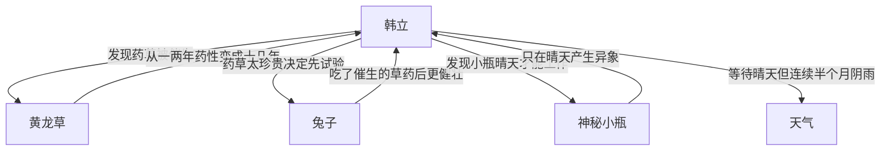

# 第一卷第二十五章关系总览

## 核心判断

第二十五章是韩立发现神秘小瓶催生药材效果的关键章节。被稀释绿液打湿的药草从一两年药性变成十几年药性，韩立欣喜若狂。但韩立冷静后发现几个待解决的问题。本章韩立还发现小瓶只在晴天才能产生异象，阴天无法工作。

## 关系图

## 关系拆解

### 1. 药草催生效果

- 韩立一大早往药园方向走去，想观察被稀释绿液打湿的药草有什么变化
- 还没走进药田就闻到几种浓郁的药香味
- 发现黄龙草叶子有些发紫，苦莲花竟然开了九个花瓣，忘忧果的果皮变成了黑色
- 原来才有一两年药性的草药，全都变成了十几年的样子
- 韩立再也忍不住了，仰天大笑起来
- 韩立仔细检查了一遍药草，确定它们和药书上所说的完全一致，真的是已经有了好些年头的珍贵药材

### 2. 韩立的冷静思考

- 韩立越想越兴奋，觉得自己这次真的是捡了宝了
- 韩立清醒下来，头脑恢复了往日的机警，开始考虑到吃掉这个从天而降的大馅饼所要面临的一些难题
- 首先这些药草从外表上看似乎是没什么问题，但实质的药性还是有待去检验
- 其次那神秘小瓶中的绿液已经用掉，不知道还会不会有异象发生继续产生这种液滴出来
- 如果以上两方面都没有什么问题，还要确实具体的掌握住这种催生药材的细节和步骤

### 3. 兔子试验

- 韩立先去谷外的大厨房，问管事又买了两只灰毛兔回来
- 这次没把兔子栓在药园里，而把兔子栓在了自己的房门口，以方便自己时刻观察它们的变化
- 然后去药田地里，把那几株催生出来的草药给小心的采了回来
- 做成了几幅的可培筋状骨的好药，又把做好的药物参杂在兔子最喜爱吃的食物上
- 一天三顿的喂给兔子们吃，以试验这些草药是否有毒

### 4. 小瓶天气条件

- 韩立焦急地等待着夜晚的来临
- 天刚一擦黑，韩立就跑到屋外把小瓶从袋子里拿了出来放在了地面上
- 从傍晚等到天亮，瓶子还没有任何的异动
- 韩立猛然想起，以前瓶子的异变都是发生在晴天，天空没有遮挡能看见星星和月亮的情况下进行的
- 而今天是个阴沉天气，满天的乌云盖顶
- 韩立准备等天放晴后再试一下
- 但此后半个月天空不但没放晴反而下起了绵绵细雨
- 两只兔子吃了参杂药物的食物后不但没有什么问题，还比以前更精神了

## 本章关系推进

- 第二十四章：韩立发现绿液洒在药地上打湿了几株药草，决定观察药草一段时间
- 第二十五章：药草被催生的效果得到证实，韩立发现小瓶只在晴天才能产生异象

## 来源

- `../resources/第一卷 七玄门风云/0025第二十五章 插柳成.txt`
