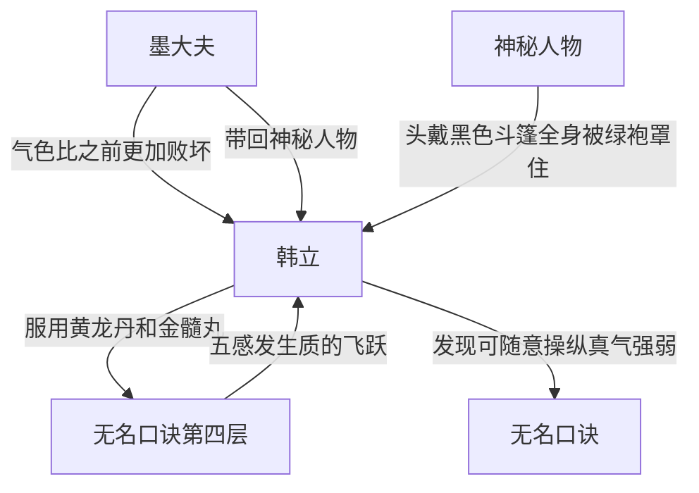

# 第一卷第二十八章关系总览

## 核心判断

第二十八章是韩立修炼达到无名口诀第四层的章节。韩立服用黄龙丹和金髓丸后，当晚就冲破了瓶颈练成了口诀第四层。四层的五感发生质的飞跃。韩立发现进入第四层后可以随意操纵体内真气的强弱。本章墨大夫回山谷了，韩立发现他气色比之前更加败坏，一副根本大限已至的模样。更令韩立讶然的是，墨大夫身后还跟着一位头戴黑色斗篷、全身被宽大绿袍罩得严严实实的神秘人物。

## 关系图

## 关系拆解

### 1. 韩立修炼第四层

- 韩立按照配方分别吃了一颗"黄龙丹"和"金髓丸"
- 在药物强大惊人的药力之下，不费吹灰之力，他就在当晚冲破了瓶颈，练成了口诀的第四层
- 一到达第四层，韩立立刻体会到了与以往截然不同的感受
- 他的五感"轰"的一下被提升到了一个不可思议的境界
- 眼中的一切事物突然间变得那么明亮，那么清晰
- 原来自己无法看得见的一些细微的东西，也一下子变得被放大了一样
- 耳朵的听觉也忽然间变得灵敏无比
- 无数各以前听过的或未听过的声响全都涌入到了耳中
- 除此之外，一些突然冒出来的奇怪气味，也让韩立知道自己的嗅觉也与以往大大不同了

### 2. 韩立的身体变化

- 韩立又惊又喜，这是他修炼这套口诀来第一次感到自己所花费的时间并没有白白浪费
- 如此与众不同感受说明这口诀并不是一无是处，而是有着它自己的独到所在
- 在此之前的几层修炼虽然也让他的五感有了一定的提升，但都没有像第四层这样改变的这么明显
- 这根本就是一次质的提升，就像彻底换了一个人一样
- 除此之外，他还感到自己的身体比以前轻快了许多，精神上也有了长足的长进
- 现在让韩立三五天不睡觉，估计都不会有太大的问题

### 3. 韩立的修炼感悟

- 韩立细细品味着身体里与以前完全不同的东西
- 他呆在原地不动一下，就能明了数十丈内所发生的大小事情
- 这种可以掌控一切的感觉，令韩立非常的痴迷不舍
- 如今他才明白，这口诀练到第四层才是真正的略有小成
- 他不禁遥想到，第四层就有如此令人难以忘怀的滋味！那练了第五层、第六层又会有什么样的美妙感受呢！

### 4. 墨大夫归来

- 韩立刚刚领会到他所修炼功法的奥妙之处不久，他名义上的师傅——墨大夫回山谷了
- 他不但自己回来，还另带回了一个神秘人物
- 墨大夫刚进入神手谷时，韩立就远远听到了早已熟悉的咳嗽声
- 他当时正在石室内打坐修炼，争取能够早日更精进一层
- 察觉到墨大夫的声响后，赶紧运气收功，走出石室，往谷口方向走去
- 去拜见这位已近一年没见面的师傅，结果在离谷口不远处迎见了墨大夫

### 5. 韩立的谨慎应对

- 一见到墨大夫，韩立大吃一惊
- 人还是原来的人，但映入眼帘的是一张气色灰败没有几分生气的面容
- 原先他虽然也是面色焦黄病怏怏的，但也不至于像现在这样气色败坏到极点
- 一副根本大限已至的模样
- 更令韩立更讶然的是，在他的身后还跟着一位头带黑色斗篷，全身上下都被一件宽大绿袍罩得严严实实的神秘人物
- 此人身材异常高大魁梧，比韩立足足高出两个头来
- 有着巨灵神样的巨大身板，但因带着斗篷，韩立无法从外面看清楚此人的面貌

## 本章关系推进

- 第二十七章：韩立估计墨大夫再有六七个月就该回七玄门
- 第二十八章：韩立修炼达到第四层，墨大夫回山谷了

## 来源

- `../resources/第一卷 七玄门风云/0028第二十八章 墨回谷.txt`
