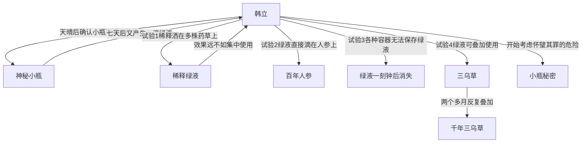

# 第一卷第二十六章关系总览

## 核心判断

第二十六章是韩立完全掌握小瓶使用方法的章节。经过一系列系统试验，韩立确认了小瓶不是消耗品而是可屡次使用的奇物。他掌握了绿液的使用方法：集中使用效果最佳、必须在取出后一刻钟内用完、可以叠加使用。两个多个月的反复试验后，韩立把一株普通三乌草培育成了千年三乌草。本章末尾韩立开始考虑小瓶带来的好处与危险。

## 关系图

## 关系拆解

### 1. 天晴后确认小瓶可重复使用

- 韩立发现绿液秘密后过了快大半个月，天终于放晴
- 当晚再次看到四年前发生过的奇观，一个个光点密密麻麻围在瓶子周围，形成大的光团
- 韩立心中高高挂起的石头总算落了下来，基本可以肯定小瓶不是一次性消耗品，而是可屡次使用的奇物

### 2. 绿液产生和试验

- 经过七天等待，小瓶里终于又出现了一滴绿液
- 韩立怀着异样的心情，在今后的数十天里又分别做了几次催熟草药的试验
- 第一次把稀释好的绿液洒在许多草药上，结果第二天只得到了大量只有一两年催生效果的普通药材
- 韩立隐隐领悟到了一些规律：绿液应该集中使用才能发挥最大效果
- 下一次的试验中，韩立干脆连稀释都省略掉，直接把绿液滴在一株人参上
- 第二天醒来时，竟然得到了一株百年人参，和一株野生的百年老人参完全没有区别
- 这次试验让韩立心里喜出望外，不是因为得到了一个稀有的药材，而是因为他已经大概掌握住了绿液的使用方法

### 3. 绿液保存试验

- 韩立又做了几次绿液保存试验，把刚刚从瓶中取出来的绿液放到了各种各样的容器之中
- 有瓷瓶、玉瓶、葫芦、银瓶等等
- 发现无论何种容器都无法把绿液保存超过一刻钟的时间
- 只要把绿液从神秘的小瓶中取出来，就必须在一刻钟的时间内用掉，否则它就会自己慢慢消失的无影无踪
- 稀释后的液体也具有相同的特征，绿液的成分最终会消失
- 韩立彻底对绿液在其他容器中的保存丧失了信心

### 4. 叠加药性测试

- 韩立在一株绿色的三乌草上滴了一滴绿液，把它变成了具有百年药性的黄色三乌草
- 过几天后又在它上面滴了一滴绿液，它的年份竟然又加强了百余年
- 韩立在之后的两个多月时间内，如此不停地重复相同的做法
- 每当有新的绿液从小瓶中产生时，他就把它滴在了这株三乌草上面
- 这三乌草的叶子渐渐的由黄色转变成了黄黑色，又由黄黑色变成了黑色
- 终于在它的叶子完全变得乌黑发亮以后，它成了一株世间少有的千年三乌草
- 韩立现在并不需要这些年份太久远的药材，数百年成份的药草就足够他自己服用的了

## 本章关系推进

- 第二十五章：韩立发现药草被催生的效果，发现小瓶晴天才能工作
- 第二十六章：韩立完全掌握小瓶使用方法，两个多月反复试验后培育出千年三乌草

## 来源

- `../resources/第一卷 七玄门风云/0026第二十六章 催药生.txt`
