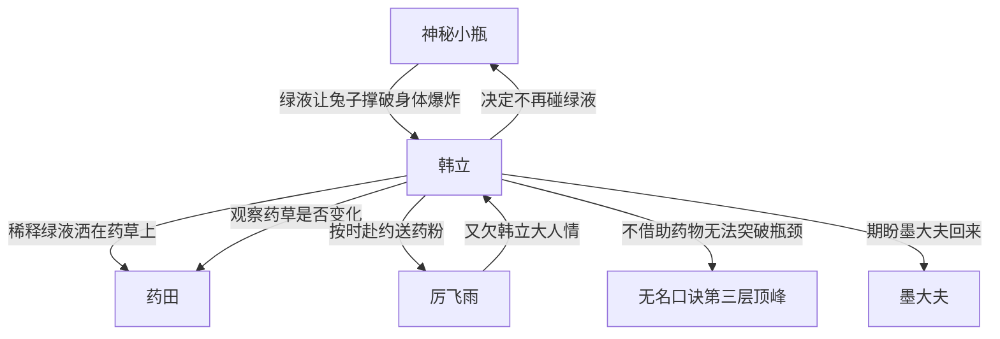

# 第一卷第二十四章关系总览

## 核心判断

第二十四章是韩立与神秘小瓶关系的转折点——从满怀期待转为恐惧退缩。绿液试验让兔子撑破身体爆炸，比韩立见过的任何毒药都更恐怖，韩立决定不再碰这绿液。同时韩立按时赴约给厉飞雨送药粉，两人的交易关系进一步巩固。韩立一天修炼发现不借助药物外力无法突破瓶颈。

## 关系图

## 关系拆解

### 1. 绿液试验的最终结果

- 两只兔子撑破身体爆炸，血肉横飞散落在地上
- 原本栓兔子的地方出现两个坑，坑周围到处是兔子散乱的残骸
- 韩立反应快跑到了十几丈外，否则会被爆炸波及
- 韩立本以为能从绿液中发现灵丹妙药，却没想到是这么恐怖的东西
- 韩立见过许多见血封喉的毒物，没有一样能让人死得这么恐怖
- 韩立决定以后不再碰这绿液，太吓人了

### 2. 韩立与厉飞雨的正式约定

- 韩立很守时，午时正点到达神手谷谷口赴约
- 厉飞雨身穿白色锦袍，背长刀，早已焦急等待大半个时辰
- 韩立将配制好的药粉装进袖珍小袋交给厉飞雨
- 使用方法：每次吃抽髓丸前先用凉开水冲服一勺药粉
- 韩立直言不讳：这只是一年份的药，凑够药材再帮他多配
- 厉飞雨神色又恢复正常，干脆地表示又欠下了韩立一份大人情
- 两人互相辞别分手了

### 3. 韩立与药田

- 韩立返回谷内后先去药园收拾了一番
- 把兔子的残骸、沾血的泥土、碎碗等统统扫到坑内
- 再把无端冒出来的两个土坑用泥土推平，恢复原状
- 韩立发现打碎的瓷碗中稀释的绿液洒落在药地上，打湿了几株药草
- 韩立决定先观察这些药草一段时间，看看是否会出现变化
- 如果药草真的变得有毒了，自己再把它们清除掉也不迟

### 4. 韩立的修炼困境

- 韩立去石室练功，希望自己在功力大进的基础上再有所突破
- 修炼无名口诀已成本能反应，不修炼都不知道待在山上该做什么
- 追求口诀更高一层次修炼，成了韩立目前生活的全部目标
- 经过一个下午的专心修炼，沮丧发现自己真的不是天才
- 距离第四层只差一个手指就能捅破，但没有丝毫寸进
- 看来自己不借助药物外力不行了，否则永远都可能在第三层呆着
- 韩立开始期盼墨大夫能够早些回来，并幸运地找到足够多药材

## 本章关系推进

- 第二十三章：韩立对绿液试验满怀期待
- 第二十四章：绿液试验结果出人意料地恐怖，韩立决定不再碰绿液。韩立和厉飞雨的约定正式完成，两人关系进一步稳固

## 来源

- `../resources/第一卷 七玄门风云/0024第二十四章 惊魂定.txt`
