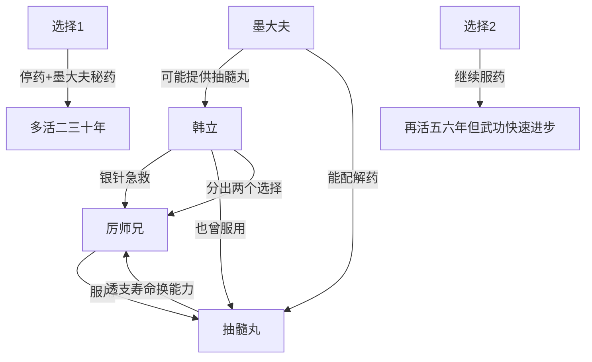

# 第一卷第二十章关系总览

## 核心判断

第二十章是全书第一个重大揭露——韩立认出了厉师兄身上携带的"抽髓丸"，并透露自己也吃过。这个发现将之前所有关于墨大夫的疑点串联在一起：墨大夫对韩立的贪婪目光、不计代价的药物投入、严禁韩立学武功——一切都在为这个药丸服务。

## 关系图

## 关系拆解

### 1. 抽髓丸——透支生命的禁药

- **成分**：合兰、蝎尾花、百年蓝蚁卵等二十三种罕见物品
- **外观**：粉红色药丸，粉嘟嘟的好看，与腥臭气味形成巨大反差
- **功效**：大幅透支身体潜力，用以后寿命提升现在能力
- **代价**：
  - 每隔一段时间必须再次服用
  - 每次服用经受抽筋吸髓的非人痛苦
  - 不服则轻则瘫痪、重则死亡
  - 即使按时服药，第一次用药后十年内必定因透支生命而死
- 极为罕见

### 2. 韩立也吃过抽髓丸

- 韩立将一粒药丸分成十份，分十次服用
- 每次都当作其他药的药引
- 因这种特殊服法，无危害身体的副作用
- 韩立之前以为世上不应还有人真的服用此药
- 韩立能认出此药并知道其详细信息——说明墨大夫曾详细告知

### 3. 韩立与厉师兄的相遇

- 韩立离开比武场后在小溪边发现厉师兄痛苦发作
- 用银针急救法救醒厉师兄（对自己也是不小负荷）
- 在厉师兄身上找到装抽髓丸的小白玉瓶
- 韩立一字一字说出抽髓丸的成分和危害，厉师兄脸色苍白露出慌乱
- 韩立透露自己也吃过，厉师兄彻底震惊
- 韩立给出两个选择，让厉师兄自己决定

### 4. 墨大夫的阴影

- 韩立能识别抽髓丸并知道详细信息——来自墨大夫
- 韩立说"求墨大夫另帮你配一服秘药"——墨大夫有能力配解药
- 韩立此前察觉墨大夫看自己时目光夹杂贪婪、渴望——现在看是因为抽髓丸的效果
- 墨大夫大量珍贵药物用在韩立身上——可能是为了配合抽髓丸的效果

## 本章关系推进

- 第十五章：韩立察觉墨大夫的贪婪目光
- 第二十章：抽髓丸揭露——解释了墨大夫一切异常行为背后的原因

## 来源

- `../resources/第一卷 七玄门风云/0020第二十章 抽髓丸.txt`
