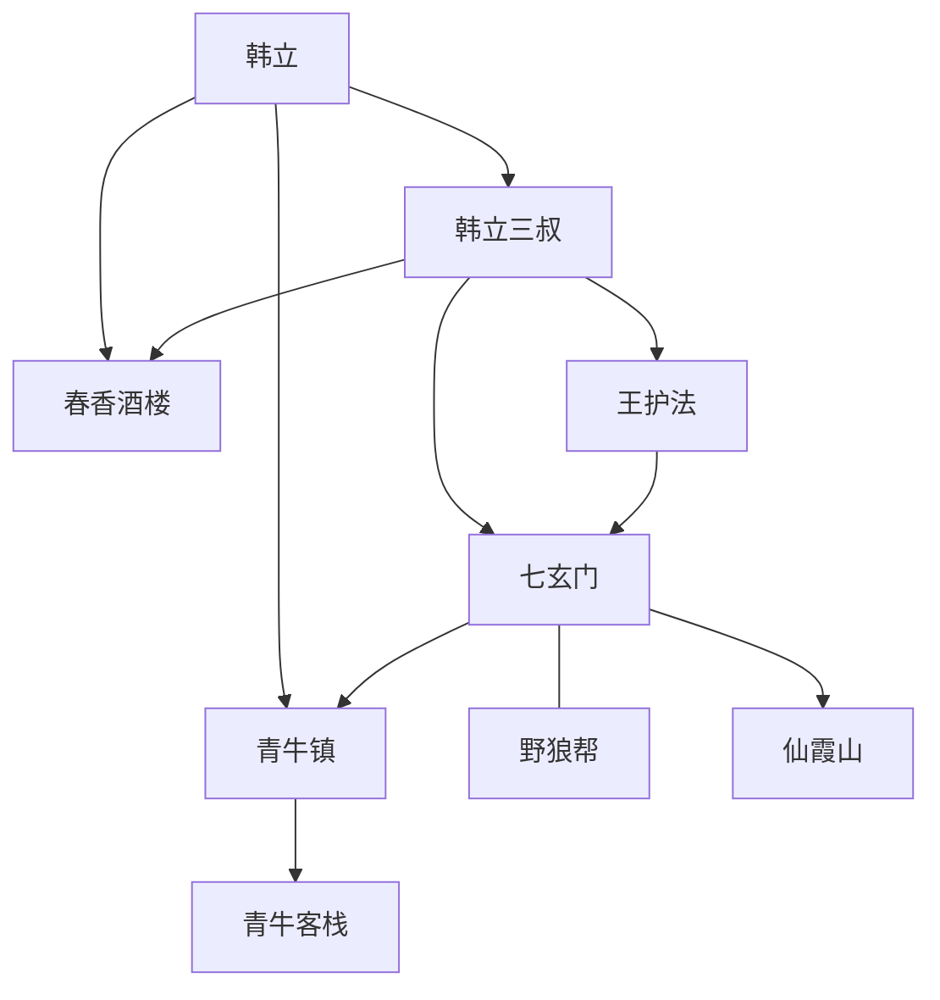

# 第一卷第二章关系总览

## 核心判断

第二章的重点不是新增复杂人物网，而是把第一章的“家庭牵引”推进成“门派入口”。关系结构从韩家内部，扩展到了青牛镇、七玄门和野狼帮所代表的外部秩序。

## 关系图

## 关系拆解

### 1. 韩立与外部世界的第一次落地接触

- [韩立](../01-人物/韩立.md) 抵达 [青牛镇](../05-场景/青牛镇.md)，这意味着他已经真正离开 [山边小村](../05-场景/山边小村.md) 的封闭生活圈。
- [春香酒楼](../05-场景/春香酒楼.md) 是韩立进入城镇后的第一个落脚点，也是他从“家”过渡到“门派体系”的缓冲空间。

### 2. 韩立三叔的双重身份被展开

- [韩立三叔](../01-人物/韩立三叔.md) 既是韩立的亲属，也是 [七玄门](../02-组织/七玄门.md) 在世俗层面的外围人员。
- 通过春香酒楼掌柜“韩胖子”这一身份，他连接了亲缘关系、地方经营和门派网络。
- 第二章里，三叔的作用从“介绍机会的人”进一步变成“具体安排韩立入门流程的人”。

### 3. 王护法代表门派正式接管韩立

- [王护法](../01-人物/王护法.md) 的到来，标志着韩立不再只是由三叔私人照看，而是被正式纳入七玄门的接引流程。
- 三叔向王护法递银两，请其路上照应韩立，体现的是门派内部关系与世俗人情同时运作。

### 4. 七玄门与野狼帮提供了更大的冲突背景

- [七玄门](../02-组织/七玄门.md) 与 [野狼帮](../02-组织/野狼帮.md) 构成第二章最重要的宏观关系。
- 这组关系目前还没有直接压到韩立个人身上，但它解释了七玄门为何近年持续扩招弟子，也解释了王护法所说“路上不太平”的背景。

## 本章关系推进

- 第一章的关键关系是“韩立是否离开家”
- 第二章的关键关系是“韩立由谁接入七玄门”

换句话说，第二章完成的是“接引链条”的闭合：

- [韩父](../01-人物/韩父.md) 同意
- [韩立三叔](../01-人物/韩立三叔.md) 带路
- [王护法](../01-人物/王护法.md) 接手
- [七玄门](../02-组织/七玄门.md) 成为下一阶段的核心场域

## 结论

如果说第一章建立的是韩立的凡人起点，那么第二章建立的是韩立进入江湖门派世界的通道结构。它让“韩立要去七玄门”这件事从口头承诺，变成了具体、可执行、已经启动的现实流程。

## 来源

- `../resources/第一卷 七玄门风云/0002第二章 青牛镇.txt`

