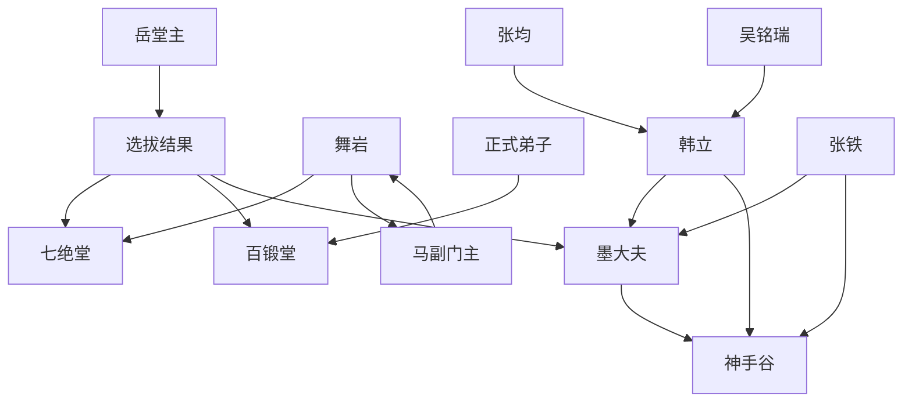

# 第一卷第五章关系总览

## 核心判断

第五章是韩立命运的第一次重大分流。选拔结果将考生分为三个层级：核心弟子（舞岩→七绝堂）、正式弟子（六人→百锻堂）、记名弟子（韩立和张铁→墨大夫）。韩立虽处于最低层级，但被墨大夫带走这一安排，实际将他引向了与同批考生完全不同的发展路径。

## 关系图

## 关系拆解

### 1. 三层分流：选拔结果的具体化

- **第一层——七绝堂**：舞岩独享。学本门绝技，出堂后至少护法
- **第二层——百锻堂**：六名正式内门弟子
- **第三层——记名弟子**：韩立与张铁，由教习带教半年，合格转正、不合格入外门
- **第四层——遣返**：其余未过关者，每人领些银子送回家

四层结果将第三章的车内阶层彻底兑现为现实差距。

### 2. 舞岩的"关系户"底牌揭示

- 张均在下山途中透露舞岩的表姐是[马副门主](../01-人物/马副门主.md)的续弦夫人
- 这意味着舞岩从年龄破例到进入七绝堂，全靠在门内的最高层关系
- 吴铭瑞的警告"副门主也是我们能胡乱议论的人"，反映门内等级森严、忌讳重重

### 3. 墨大夫与韩立：最关键的转折

- [墨大夫](../01-人物/墨大夫.md)在门内地位极高（张均称其比堂主甚至副门主更值得尊敬）
- 随手一指就选中了韩立和张铁，语气不容置疑
- 韩立成为"炼药童子"，这是其在七玄门内的第一个具体岗位
- 被带入[神手谷](../05-场景/神手谷.md)，一个封闭、外人难入的空间

### 4. 神手谷：韩立的独立发展区

- 神手谷的药田为韩立接触炼药提供了物质基础
- 谷内封闭，外人难入，为后续神秘瓶子的使用提供了安全环境
- 韩立与张铁被安排在谷内，与主门派的百锻堂/七绝堂体系相对独立

## 本章关系推进

- 第四章：韩立在七玄门的选拔中处于什么位置——答：最低层
- 第五章：韩立在七玄门的实际发展路径是什么——答：跟随墨大夫，进入神手谷

第五章表面是"分流"，实际是"分轨"。韩立看似落得最低档，但被墨大夫带走意味着他进入了与百锻堂和七绝堂完全不同的轨道。

## 来源

- `../resources/第一卷 七玄门风云/0005第五章 墨大夫.txt`
