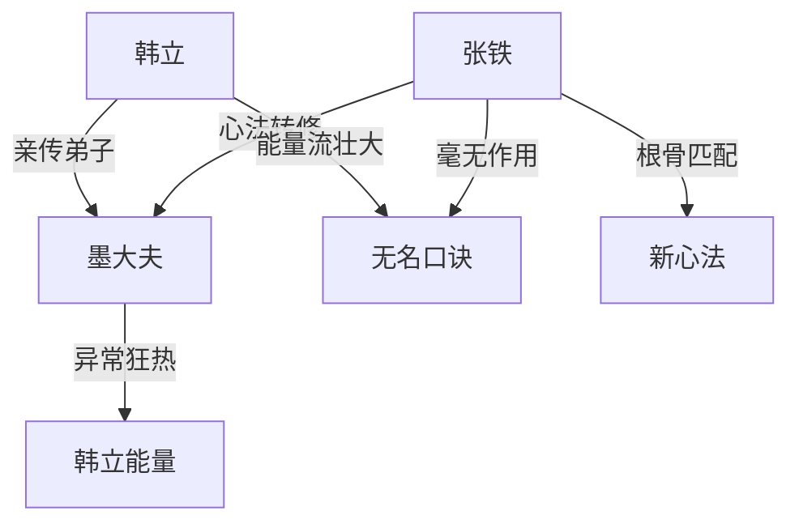

# 第一卷第八章关系总览

## 核心判断

第八章是韩立身份转折的关键章。核心事件是墨大夫的半年考核——韩立通过考核成为亲传弟子，张铁因根骨适合别的心法同样过关。本章最重要的信息不是"谁过关了"，而是墨大夫对韩立修炼成果所表现出的异常狂热反应，远超一位师父对弟子的正常满意。

## 关系图

## 关系拆解

### 1. 韩立：从记名弟子到亲传弟子

- 韩立半年修炼的成果：体内的能量流从"头发丝"粗细增长至"棉线"大小
- 能量已具备自主性——在受墨大夫的外界刺激时自行运行了一周天
- 身份升级为"亲传弟子"，而非普通正式弟子
- 这是韩立首次获得"亲传"身份，此前只有舞岩这种关系户才能进入七绝堂得到嫡传待遇

### 2. 墨大夫的异常反应

- 对张铁：仅"眼里稍微露出了一丝失望"，没有责骂——冷淡但有基本耐心
- 对韩立：一连串反常反应——"情不自禁""狂热神色""双手发颤""放声大笑""死死抓住双肩""看奇珍异宝""疯狂神情"
- 反应迅速自控："立刻停止大笑""恢复以往平静"——但"偶尔看向韩立的热切目光"暴露了真实情绪
- 核心疑问：韩立的修炼成果为何会引发如此极端的反应？墨大夫到底在韩立身上看到了什么？

### 3. 张铁的意外过关

- 墨大夫确认口诀对张铁"没有丝毫的作用"
- 过关原因：根骨另有一种心法适合，属于资源再利用而非浪费
- 与韩立的关系：张铁在考核前"早已被刚才的事给惊呆了"——全程目睹了墨大夫对韩立的狂热反应

### 4. 无名口诀的适配性问题

- 韩立：有效果但极缓慢（头发丝→棉线），属于"低效率但有产出"
- 张铁：完全无效，无论多努力都没有一丝效果
- 可推知：无名口诀对不同人的效果差异极大，可能与个人体质或根骨有关

## 本章关系推进

- 第七章：韩立经历修炼艰难期，二人均通过考核成为正式弟子（第七章视角）
- 第八章：回到考核现场，详细展示考核过程——韩立成为亲传弟子，墨大夫的反应揭示其深层动机
- 第八章与第七章的关系：第七章以概述方式交代了考核结果，第八章则以场景化方式回述了考核现场，补充了第七章未展现的细节——墨大夫的异常反应和韩立的亲传身份

## 来源

- `../resources/第一卷 七玄门风云/0008第八章 入门弟子.txt`
