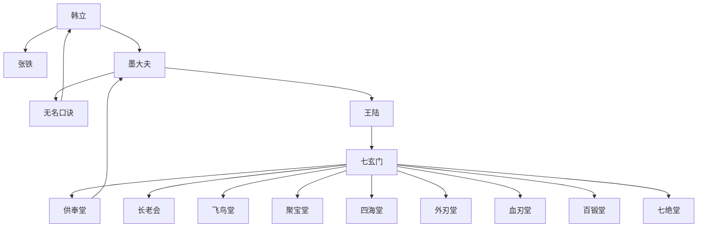

# 第一卷第六章关系总览

## 核心判断

第六章是韩立在神手谷的日常开篇。本章不推进主线冲突，而是建立韩立的神手谷生活秩序：与张铁的友好关系、墨大夫的无名口诀传授、以及韩立对半年考核的低期待。同时通过韩立的侧面了解，补全了七玄门的组织架构和墨大夫的来历。

## 关系图

## 关系拆解

### 1. 韩立与张铁的友好关系

- [张铁](../01-人物/张铁.md)为韩立领晚饭，二人初次互动即显友好
- 韩立称张铁为"张哥"，张铁憨厚、热心，"力气还有一把"
- 两个同为记名弟子的孩子，在神手谷中互相照应

### 2. 无名口诀：韩立的第一个正式功法

- [墨大夫](../01-人物/墨大夫.md)传授的修身养性功法，不教武功
- 韩立半年考核的唯一内容——只查此口诀修炼情况
- 墨大夫严令不得外传，泄露则严惩并踢出师门
- 韩立目前不知其真正来历，只知"不能克敌制胜但可强身健体"

### 3. 韩立对考核的低期待

- 韩立认为即使半年后不过关，也可成为外门弟子（如三叔）
- "隐隐约约希望自己没能过关，这样就可以早点出山见到父母"
- 这反映了韩立对家庭的眷恋，以及对修炼前景的无知

### 4. 七玄门组织架构初现

- **门主**：王陆（七绝上人嫡传后人）
- **副门主**：三位（含马副门主）
- **长老会**：只在正门主之下，与副门主并驾齐驱
- **外门四堂**：飞鸟堂、聚宝堂、四海堂、外刃堂
- **内门四堂**：百锻堂、七绝堂、供奉堂、血刃堂

### 5. 墨大夫的来历揭示

- 原本不是七玄门弟子
- 数年前救了王陆门主性命（妙手回春，药到病除）
- 除医术高超外还有一身不弱的武功
- 被请回门内，安排在神手谷落户，成为供奉堂供奉
- 用医术救下不少门内弟子，因此受尊敬

## 本章关系推进

- 第五章：韩立被墨大夫带走，进入神手谷
- 第六章：韩立在神手谷的日常秩序建立——功法、考核、人际关系

第六章是"安顿章"。它建立的是韩立在神手谷的生活框架，而非推进主线冲突。但这个框架中隐藏的关键信息是：无名口诀的真正来历和潜力，韩立目前一无所知。

## 来源

- `../resources/第一卷 七玄门风云/0006第六章 无名口诀.txt`
