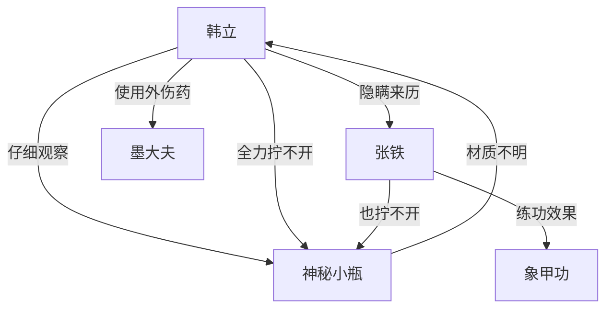

# 第一卷第十一章关系总览

## 核心判断

第十一章是神秘小瓶的第一次"正式出场"——从第十章的意外捡拾，到第十一章韩立在私密空间中对瓶子的仔细观察和反复尝试。本章最重要的信息有两点：瓶子材质的异常确认和韩立对瓶子的事隐瞒张铁。前者推进了读者对瓶子的好奇，后者展现了韩立性格中谨慎和防备的一面。

## 关系图

## 关系拆解

### 1. 神秘小瓶的材质确认

- 韩立用抹布把瓶子擦干净后仔细打量：通体淡淡的浅绿色，瓶面印有墨绿色叶片状花纹
- 花纹呈叶片状，栩栩如生，"摸上去有一种凸出来的感觉，似是用真的树叶直接镶嵌上去一样"
- 瓶子不大，"用一只手掌就能把它全部握住，比自己的药瓶还要小上那么一分"
- 材质既非金属也非瓷器——这是韩立的明确观察结论：
  - 没有普通金属的冰凉感觉
  - 没有一般瓷器表面光滑的纹理
  - 淡绿色是材质本身的天然色，不是后天加染的
- 这是全书第一次明确：小瓶的材质是韩立完全不认识的

### 2. 瓶盖的无法打开

- 韩立"使出全身的力道"，"一连拧了十几下"，"觉得手臂都酸了"——但瓶盖和瓶身"如同通体铸成一般，纹丝不动"
- 与第十章的"用劲拧了拧"形成对比：第十章只是初步尝试，这次是全力尝试
- 韩立"仔仔细细的检查了一遍"，没有发现任何隐秘机关

### 3. 张铁的出场与象甲功进展

- 张铁在韩立屋中等了很久才回来，"穿着薄薄的青布衫，浑身上下隐隐约约的冒着热气，满头大汗"——练功后的正常状态
- 张铁现在的力气："双手各能提起数十斤的水桶，并能快步如飞的上下山。现在谷里的大水缸，都是他每天准时打满的"——象甲功的效果非常显著
- 张铁拧不开瓶子："这东西还真够结实，好难拧开啊！到底是什么制成的？"

### 4. 韩立的隐瞒行为

- 韩立"不知道为什么，并不想告诉他关于瓶子的实情。也许只是下意识的，把有关瓶子的事情当成了自己的小秘密"
- 这是韩立与张铁之间首次出现隐瞒——此前两人是"无话不说的密友"
- 韩立对张铁隐瞒了脚伤的真实原因和瓶子的来历
- 这种本能的秘密保护意识是韩立性格的重要侧面

## 本章关系推进

- 第十章：韩立意外发现神秘小瓶
- 第十一章：韩立确认瓶子材质的异常，反复尝试无法打开，开始对身边人隐瞒此事
- 两章衔接：第十章末尾韩立把瓶子揣回住处，第十一章开头韩立回到住处处理伤和瓶子

## 来源

- `../resources/第一卷 七玄门风云/0011第十一章 瓶难开.txt`
