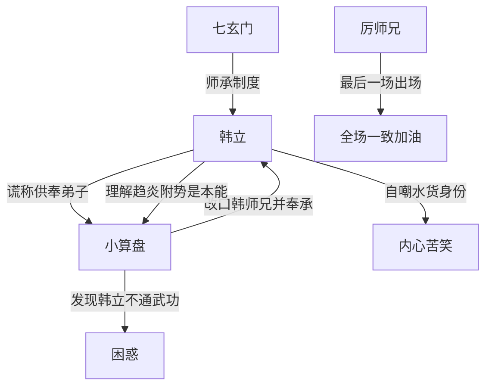

# 第一卷第十七章关系总览

## 核心判断

第十七章（上）以小算盘为镜子，照出韩立的处世智慧——他利用"供奉弟子"的虚名获得尊重，同时内心清楚自己是水货。而小算盘的趋炎附势被写得入木三分。本章同时补叙了七玄门的弟子师承制度。

## 关系图

## 关系拆解

### 1. 韩立与小算盘——虚名换尊重

- 小算盘打听韩立师承，猜测他是大人物弟子
- 韩立谎称是某供奉的弟子，不便透漏名字
- 小算盘反应：立刻改口"韩师兄"并大肆奉承
- 小算盘心理活动："此人长得黑黑的，一脸的笨样子，怎么也有供奉收他做弟子"
- 韩立内心判断：小算盘"趋炎附势只是人的本能"，没有丝毫瞧不起他
- 韩立自知是"水货"，随便找个弟子都能打倒自己
- 小算盘暗中观察：韩立太阳穴没凸起、眼中没精光，"怎么看也是一个不通武功之人"

### 2. 七玄门师承制度补全

- 一般弟子：百锻堂两年基础训练后拜师学习高深武功
- 杰出弟子：不经训练直接进入七绝堂，被门主收为入室弟子
- 突出弟子：被长老、堂主、供奉看中收为亲传弟子
- 韩立实际上属于"亲传弟子"一类（墨大夫是供奉），但他不敢说墨大夫的名字

### 3. 厉师兄——全场的焦点

- 王大胖方最后一场派出的人，这批弟子中武艺最高
- "一手的奔雷刀法刚猛无比，能碎石断金"
- 神色冷酷，手持寒光四射长刀，一言不发闭目
- 出场后全场不分穷富一致为他加油
- 小算盘对厉师兄充满信心

## 本章关系推进

- 第十六章：阶层矛盾展现
- 第十七章：韩立用"虚名"应对人际关系，七玄门师承制度补全，厉师兄登场

## 来源

- `../resources/第一卷 七玄门风云/0017第十七章 厉师兄（1）.txt`
