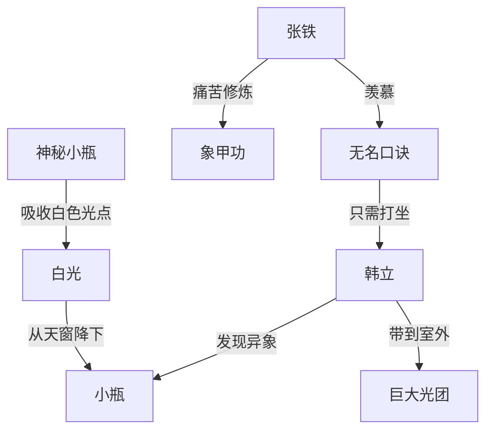

# 第一卷第十三章关系总览

## 核心判断

第十三章是全书第一个"超自然现象"的正式登场——小瓶开始吸收从天而降的白色光芒。这个发现彻底确认了瓶子不是普通器物，而是有某种特殊功能的法宝。本章同时通过张铁的视角，展现了象甲功修炼的极端痛苦。

## 关系图

## 关系拆解

### 1. 小瓶的第一个特性——吸收白光

- **发现方式**：韩立拿着瓶子睡觉时，被冰凉感觉惊醒
- **异象描述**：
  - 屋内：一丝丝肉眼可见的白色光芒从天窗降下，聚集到瓶子上形成米粒大小的白色光点，整只瓶子被一层薄薄的白色光芒团团围住
  - 室外：比屋内多得多的光丝从四面八方汇聚，形成脸盆大小的巨大光团
- **光点特性**：
  - 白色，非常柔和不耀眼
  - 触感冰凉
  - "拼命往瓶子里挤，争先恐后，似是活了一般"
  - 不是"吸收"，而是光点在拼命往瓶子里挤
- **触发条件**：
  - 瓶子裸露在空气中，在皮袋中则光点消失
  - 夜间出现（韩立睡觉时半夜发现）
  - 室外空旷处光丝比室内多得多

### 2. 张铁的痛苦练功日常

- 张铁对象甲功"谈虎色变"——被墨大夫折磨得叫苦连天
- 象甲功第一层的修炼：
  - 定时定点泡难闻的药汁
  - 不时经受墨大夫的木棒敲打，说要淬炼筋骨
  - 有一段时间每天晚上无法入睡，浑身红肿，碰木床就痛得呲牙咧嘴
- 张铁觉得那是一场"噩梦"
- 但张铁对韩立所练无名口诀从心里往外羡慕——只需打坐念经就行

### 3. 张铁和韩立的关系

- 张铁主动端饭到韩立住处陪他吃晚饭
- 两人交流练功心得——张铁羡慕无名口诀，韩立无语
- 韩立理解张铁对象甲功后几层的恐惧，崇拜张铁能坚持到现在
- 韩立心想：换作自己说什么也不会练这种自虐的武功
- 两人的友情稳固，张铁的憨厚和热心继续展现

## 本章关系推进

- 第十二章：小瓶无法砸碎，确认物理特性异常
- 第十三章：小瓶开始展现超自然特性——吸收白光，这是全书第一个明确的功能性发现
- 从"砸不碎"到"吸收光点"，小瓶的神秘面纱开始揭开

## 来源

- `../resources/第一卷 七玄门风云/0013第十三章 异象起.txt`
