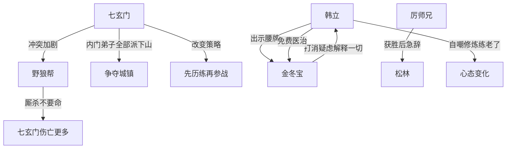

# 第一卷第十九章关系总览

## 核心判断

第十九章揭示了"没有年长师兄在场"的根本原因——七玄门与野狼帮的激烈冲突将山上大部分内门弟子派往山下。韩立四年的闭关让他完全避开了这场动荡。本章是"比武"这条线的收尾，也是"江湖冲突"这条线的开启。

## 关系图

## 关系拆解

### 1. 七玄门与野狼帮的冲突升级

- 双方为争夺几块说不清归属的富裕城镇打了十几仗
- 野狼帮用训练马贼的一套训练帮众，厮杀不要命、见血更疯狂
- 七玄门弟子武艺较高但无狠劲，拼杀缩手缩脚，死伤更多
- 几位大人物把大部分内门弟子全都派出去参加拼斗
- 目的：地盘不能失 + 让弟子见江湖残酷、磨练实战经验
- 策略调整：先执行不太重要的任务历练，有经验后再参战，伤亡减少
- 此策略两年内纳入门规：所有弟子出师后必须下山历练，回来后才能授予实职
- 山上只剩未出师的年幼弟子和必要守山弟子

### 2. 比武收尾

- 厉师兄以长刀震飞赵子灵软剑，赵子灵甘拜下风
- 厉师兄突然有急事告辞，露一手俊俏轻功消失于松林
- 韩立评价：功夫不错，但喜欢炫耀、年轻气盛

### 3. 韩立与金冬宝

- 韩立出示腰牌打消金冬宝疑虑
- 金冬宝以为靠上了"大树"
- 韩立拍他肩膀说"以后生病受伤，找我就行了，我给你免费医治"
- 韩立望了望场中又起争执的人群，头也不回走进松林
- 金冬宝莫名其妙发呆，没理解韩立的意思

## 本章关系推进

- 第十八章：韩立发现没有年长师兄在场
- 第十九章：原因揭晓——七玄门与野狼帮冲突导致山上内门弟子几乎全被派下山

## 来源

- `../resources/第一卷 七玄门风云/0019第十九章 江湖斗.txt`
