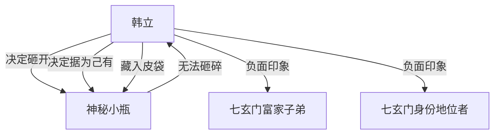

# 第一卷第十二章关系总览

## 核心判断

第十二章是小瓶物理特性的确认章。韩立用铁锤全力砸了瓶子十几下，把半个瓶身砸进青砖里，瓶子仍无一丝痕迹。这个"砸不开"的结论，加上前文"拧不开"，基本确认小瓶不是普通容器。同时韩立的心理活动揭示了他决定据为己有的深层动机——穷苦出身对权贵阶层的敌意。

## 关系图

## 关系拆解

### 1. 小瓶的物理特性确认

- 韩立从试探性轻砸开始，逐步加力：五分力 → 七分力 → 十分力 → 十二分力
- 最后一下"把半个瓶身都砸进了青砖里"——这是很大的冲击力
- 结果：瓶子仍然"通体完整"，"没有一丝的砸痕留在上面"，"绿莹莹的，整个瓶面仍然保持着光洁"
- 韩立的判断："这绝对是个非同寻常的好东西"
- 小瓶至此已确认两个特性：拧不开 + 砸不碎

### 2. 韩立的心理活动——据为己有的决定

- **不找他人帮忙的原因**：
  - 已把瓶子当成自己的宝物，不愿再让外人知道
  - 山上的人有可能是失主，知道了可能要回去
  - 韩立"万万舍不得把它送回去"
- **阶层心理**：
  - 富家子弟：排斥瞧不起穷弟子，言语讥讽侮辱，多次群殴，韩立被打过鼻青脸肿
  - 身份地位者：王护法收贿赂、舞岩靠权势进入七绝堂
  - 韩立对两种人都没好印象
- **最终决定**：把瓶子放入母亲缝制的小皮袋，和野猪牙平安符一起挂在脖子上

### 3. 韩立的底层出身背景补叙

- 韩家从小就很穷，全家人忙碌一整天也常常吃不饱一顿饭
- 韩立看到富家子弟大手脚花钱就心里不舒服
- 韩立曾参与穷弟子和富家子弟的群殴，被习过武的富家子弟打得鼻青脸肿
- 韩立判断：只要不是主动去偷去抢，地上捡到的东西归自己所有
- 韩立对大人的"伟���形象"已基本破裂

### 4. 韩立的谨慎和警觉

- 砸瓶子前再三思量，知道这是"不是办法的办法"
- 砸瓶子时担心破坏瓶内物品，从试探开始逐步加力
- 砸完后把锤子放回原处，装作若无其事
- 藏好瓶子后"往四下看了看，没有人在"才放心
- "拖着受伤的脚"直到天色全黑才回屋内

## 本章关系推进

- 第十一章：韩立确认小瓶材质异常，对张铁隐瞒
- 第十二章：韩立确认小瓶无法砸碎，决定据为己有并贴身收藏，小瓶从此成为韩立的秘密随身之物

## 来源

- `../resources/第一卷 七玄门风云/0012第十二章 砸瓶子.txt`
