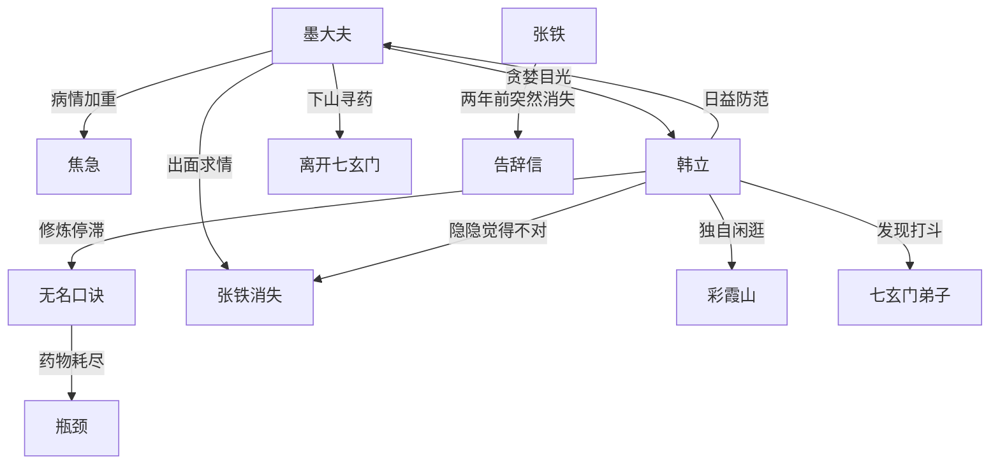

# 第一卷第十五章关系总览

## 核心判断

第十五章是墨大夫与韩立关系中最重要的转折之一——墨大夫对韩立的"贪婪"首次被韩立明确察觉，张铁的神秘消失和墨大夫下山寻药让韩立完全孤身一人，为后续的冲突和危机埋下伏笔。

## 关系图

## 关系拆解

### 1. 墨大夫与韩立——从师徒到"珍宝"

- 墨大夫对韩立重视到了异常程度：
  - 按约定发的银子比一般弟子多得多
  - 目光"像是在看一件稀世珍宝，爱护万分"
  - 背后偶尔夹杂"贪婪、渴望"的神情
  - "看自己不像是在看一个活人，而像是在看一件东西"
- 墨大夫将所有心血和家当用在韩立身上，创造最好的修炼条件
- 韩立修炼停滞让墨大夫"焦黄的面皮变得有些发白"
- 韩立感受：毛骨悚然、困惑，但心底存了防范之意且越来越强

### 2. 韩立的修炼困境

- 无名口诀卡在第三层，一年无提高
- 墨大夫珍贵药物已全部用光
- 没了药物辅助，修炼彻底停滞
- 韩立面对墨大夫时很惭愧
- 墨大夫武功很高却无法察知韩立修炼详情，只能把脉得知一二

### 3. 张铁的神秘消失

- 张铁两年前练成象甲功第三层后突然消失
- 只留下一封告辞信，称要去"闯江湖"
- 此事在七玄门引起轩然大波
- 墨大夫出头求情，才未连累张铁的推荐人和亲戚
- 韩立觉得太突然，难过了好几天
- 韩立"隐隐觉得不太对劲"
- 韩立猜想：张铁莫不是害怕象甲功第四层的修炼才偷偷溜掉

### 4. 韩立与七玄门的关系疏远

- 韩立四年没有走出神手谷一次
- 同门早把韩立忘得一干二净
- 巡山弟子看到韩立穿着门内服饰却相貌陌生，警觉盘问
- 神手谷只剩韩立一人，墨大夫和张铁都不在

## 本章关系推进

- 第十四章：小瓶打开，四年时间跳跃，韩立练到第三层
- 第十五章：墨大夫异常目光首次被点明，张铁两年前突然消失，韩立陷入修炼瓶颈

## 来源

- `../resources/第一卷 七玄门风云/0015第十五章 四年后.txt`
