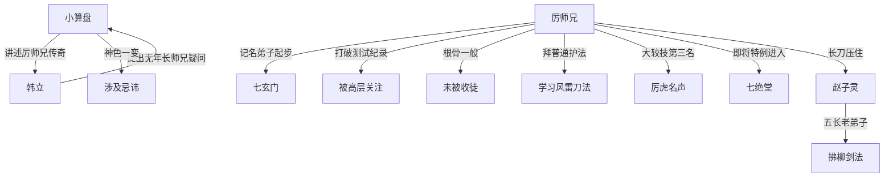

# 第一卷第十八章关系总览

## 核心判断

第十八章通过小算盘之口补全了厉师兄的完整传奇经历——从记名弟子到"厉虎"的成长路径，展现了七玄门内即使根骨一般也能凭努力拼搏出成就的可能性。但本章最关键的伏笔是韩立提出的疑问：为什么没有年长师兄在场？这暗示了某种不寻常的情况。

## 关系图

## 关系拆解

### 1. 厉师兄的传奇经历

- 四年前上山，未一次过关，先成记名弟子
- 半年测试：所有项目第一，对抗中唯一撑过三十招，打破所有记名弟子纪录
- 被高层关注，但检查发现根骨一般、潜力有限，未被收为弟子
- 两年基础训练后拜普通护法门下，学到风雷刀法等普通武功
- 次年小一辈弟子大较技冲进前十六（新入门弟子唯一名列前茅者）
- 随后各种比试勇猛无比，屡次高名次
- 去年大较技拿下第三名，前两名为入门十几年的老弟子
- 被派往山外执行重大行动，立下不少功劳
- 江湖上有"厉虎"赫赫名声
- 即将特例进入七绝堂修炼更高深武功

### 2. 最后一场比试

- 张长贵方推诿半天，赵子灵硬着头皮出场
- 赵子灵：五长老弟子，拂柳剑法难缠，是张长贵方最厉害的
- 厉师兄一声大喝震得全场嗡嗡响
- 长刀幻化十多片刀影，赵子灵被压得死死的
- 小算盘：新弟子中谁也打不过厉师兄，换人也白搭

### 3. 韩立的疑问

- 为什么没有年长一点的师兄在场？就算不允许出场，看热闹总应该有人来吧
- 场内外都是十几岁的新弟子，一个年长师兄都没有
- 小算盘神色一变，露出古怪目光——似乎触及了某种忌讳

## 本章关系推进

- 第十七章：厉师兄登场，全场一致认可
- 第十八章：厉师兄完整传奇补全，韩立发现"没有年长师兄"的异常情况

## 来源

- `../resources/第一卷 七玄门风云/0018第十八章 厉师兄（2）.txt`
