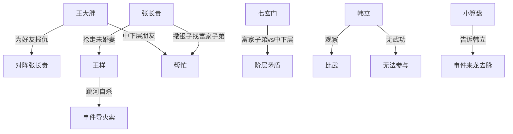

# 第一卷第十六章关系总览

## 核心判断

第十六章不是以韩立为主线推动剧情，而是通过一场"替堂弟报仇"的比武，展现七玄门内部日益尖锐的阶层矛盾——富家子弟与中下层弟子的对立已从隐性的排斥演变为公开的群体性冲突。

## 关系图

## 关系拆解

### 1. 比武事件来龙去脉

- 王样（王大胖堂弟，外门弟子）从小被许配给一个女孩
- 张长贵（某钱庄老板儿子，内门弟子）看上了该女孩
- 张长贵用金钱攻势让女孩及其父母改许给自己，退了王样的聘礼
- 王样整日要死要活，最终跳河自杀
- 王大胖从小与堂弟要好，找张长贵决斗：输的人斟茶施礼、磕头认错
- 张长贵自知武功不如王大胖，要求多比几场以总结果定输赢

### 2. 七玄门内的阶层对立

- 张长贵方：仗着钱多，撒银子找同门富家子弟中的好手帮忙
- 王大胖方：没钱但人缘广，结交的中下层朋友多，许多武功不错的人自愿帮忙
- 围观者众多，形成立场鲜明、两方面充满敌意的火爆局面
- 这场比试是七玄门内富家子弟与中下层弟子矛盾的外化和升级

### 3. 韩立的处境

- 几年闭关修炼消磨了热血冲动
- 从未练过拳脚兵器武功，打不过任何普通同门
- 看了比武后打算老老实实回山谷

## 本章关系推进

- 第十二章：韩立对七玄门阶层问题的内心认知
- 第十六章：七玄门阶层矛盾从"韩立的个人感受"变为"公开的群体冲突"

## 来源

- `../resources/第一卷 七玄门风云/0016第十六章 小算盘.txt`
