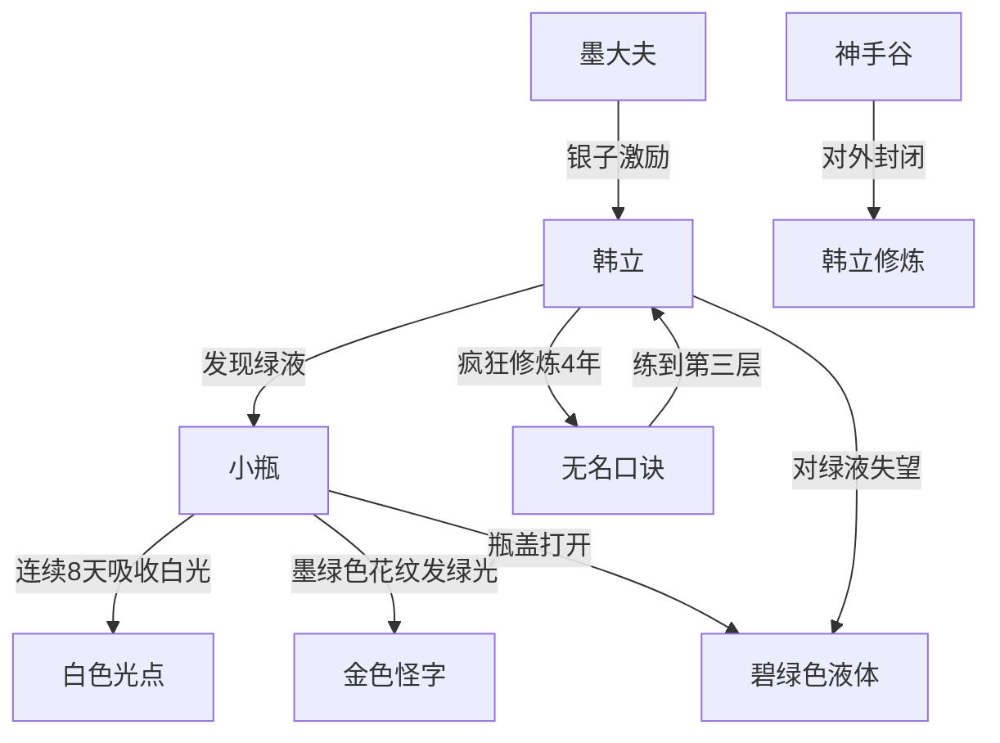

# 第一卷第十四章关系总览

## 核心判断

第十四章是神秘小瓶的第一个重大突破——瓶子终于被打开，露出一滴碧绿色神秘液体。这是全书最重要的伏笔之一。同时本章包含了一个四年的时间跳跃，从韩立十岁到十四岁。

## 关系图

## 关系拆解

### 1. 小瓶的第二个阶段——打开瓶盖

- **触发过程**：连续八天吸收白光后，第八天吸收只维持半刻钟就停止
- **瓶子变化**：
  - 墨绿色花纹突然发出耀眼的绿色光芒
  - 瓶面浮现出几个金黄色文字符号
  - 文字"结构柔顺，笔画奇特，有一种说不出的上古韵味"
  - 怪字符不停闪烁游动，只持续一刹那就消失
  - 留下几个凸出来的金色怪字符
- **瓶盖打开**：之前怎么都拧不开的瓶盖，突然毫不费力就取了下来
- **瓶内内容**：一滴黄豆大的碧绿色液体，缓缓滚动，把整个瓶壁映成绿莹莹一片
- **韩立反应**：本想探寻惊喜，结果只是一滴液体，感到失望

### 2. 墨大夫的激励策略

- 韩立因研究瓶子连续几夜失眠，白天练功效率降低
- 墨大夫狠狠训斥了韩立一顿
- 墨大夫看出韩立对钱财的渴望，开出条件："每把这口诀修炼提高一层，我就把每月该发给你的银子，再提高一倍"
- 一句话就"把他绑在了拼命修炼的战车之上"
- 神手谷对外封闭，连看病治人都在谷外进行
- 韩立日常衣食不操半点心，专心修炼

### 3. 四年时间跳跃

- 时间跨度：秋去冬来，春过夏至，一晃四年
- 韩立从十岁长到十四岁
- 外表变化：皮肤黝黑、沉默坚毅的乡村少年，不引人注目
- 修炼成果：无名口诀水到渠成练到第三层
- 日常生活：石室与住处之间穿梭，偶尔学医术、翻各类书籍

## 本章关系推进

- 第十三章：小瓶首次展现吸收白光特性
- 第十四章：小瓶吸收白光积累到一定程度后打开，露出一滴碧绿色液体，小瓶的神秘性进一步提升

## 来源

- `../resources/第一卷 七玄门风云/0014第十四章 神秘液.txt`
