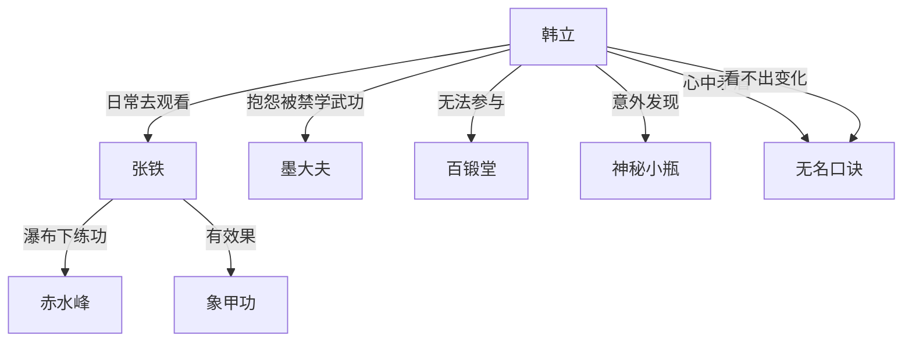

# 第一卷第十章关系总览

## 核心判断

第十章是全书最重要的伏笔章。表面是一条平淡的日常路线——韩立去看张铁练功、抱怨不能学武功——但章节后半段的神秘小瓶是全书第一个真正改变韩立命运轨迹的关键道具。本章前半段的"原地不前"和后半段的"即将改变一切"形成强烈的反讽。

## 关系图

## 关系拆解

### 1. 神秘小瓶的首次出现

- 发现方式：韩立在秋末落叶堆中踢到，完全意外
- 外观：绿莹莹的，有墨绿色叶状花纹，拳头大小，细长颈的圆瓶状，顶端有小瓶盖密封
- 质地：金属制成，沉甸甸的极重，不大但能把脚撞痛
- 韩立尝试打开但没拧动
- 瓶内听不出有东西晃动
- 韩立为防止被他人看见，立即揣到怀里——这是下意识地保护这个未知之物
- 小瓶的来历、用途、所有者在当前完全未知，是全书最大伏笔

### 2. 韩立的内心矛盾

- **不满面**：墨大夫严禁他接触兵器，不准学其他武功。同期弟子武功一日千里，自己却"原地不前""看不出有什么变化"
- **自我安慰面**：若不是被墨大夫收入门下，自己可能根本过不了考核，更不可能留在山上寄钱回家
- 这种矛盾心态反映了韩立务实的一面——既想要更多（学武功），又知道已有条件已经比很多人好

### 3. 韩立与张铁的友情延续

- 韩立"每天按时准点"去看张铁在瀑布下练功
- 动机：想看张铁"呲牙咧嘴的怪样子"——带有朋友间轻松的调侃意味
- 韩立觉得张铁可能已经后悔练象甲功了，打算过些日子帮张铁向墨大夫求情改练别的
- 张铁两个月修炼后确实有变化：皮糙肉厚更能挨打，力气也大了许多——象甲功确实在起作用

### 4. 百锻堂的间接出现

- 韩立听到远处山峰上传来兵器撞击声和喝彩声——百锻堂教习在训练新入门弟子的兵器格斗
- 韩立看到后"心里有些不是滋味"，也想拿真刀真枪耍一把
- 偶尔私下从交好同门处借兵刃过把干瘾
- 这个场景提醒读者：韩立被隔离在正常武学训练体系之外

## 本章关系推进

- 第九章：韩立练成第一层，张铁练象甲功，两条培养路线明确
- 第十章：韩立对自身停滞感到迷茫的同时，意外发现神秘小瓶——这个尚未揭示的小瓶即将彻底改变韩立的修炼轨迹。第九章中韩立觉得自己"原地不前"，第十章末尾小瓶的出现暗示一切即将改变

## 来源

- `../resources/第一卷 七玄门风云/0010第十章 神秘瓶子.txt`
