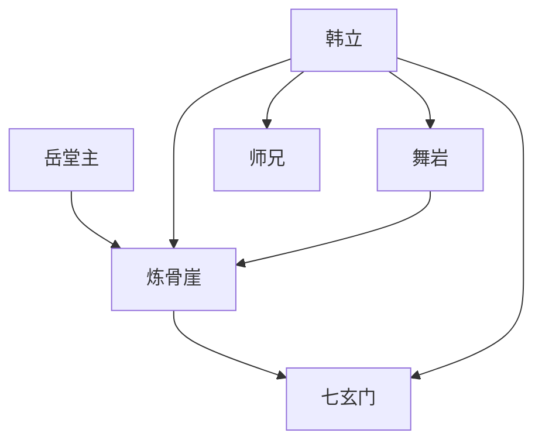

# 第一卷第四章关系总览

## 核心判断

第四章是一章"压力测试"。它不新增大量人物或组织，而是通过炼骨崖的三段考验，将第三章的考生阶层差距具体化为体力与意志的对决。韩立在极限状态下的表现，是对其性格的第一次正面验证。

## 关系图

## 关系拆解

### 1. 炼骨崖：从阶层到实力的检验

- 第三章的车内三类人结构，在[炼骨崖](../05-场景/炼骨崖.md)上被放大为实际的攀登差距
- [舞岩](../01-人物/舞岩.md)凭借年龄优势和武功基础始终领先，[韩立](../01-人物/韩立.md)在体力极限处挣扎
- 三层路段（竹林→岩壁→山崖）是一层层筛人的设计，越往后越残酷

### 2. 韩立的第一次"狠劲"

- 韩立在体力耗尽时想到家人和三叔的叮嘱，继续坚持
- 此前"早就不在乎入不入得了七玄门"，但"一股狠劲发作起来，这口气堵在里头，非要追上其他人不可"
- 这是韩立性格中隐忍坚韧的第一次正面展现，非口头设定，而是在极限压力下的行为体现

### 3. 舞岩与韩立的初次对立

- 舞岩在崖顶向下方伸出小拇指比划并狂笑，是第一次对韩立等人的直接羞辱
- 韩立"心里一阵气恼"，但因体力耗尽只能继续攀爬
- 这一对立目前还只是强者对弱者的嘲讽，但已埋下后续冲突的种子

### 4. 门派的保护机制

- 身后师兄一动不动地站在下方，在韩立险些掉落时摆出防护姿势
- 师兄"身上一丝灰尘都没沾"，与考生的狼狈形成对比，也展示门派弟子的实力差距
- 测试虽残酷，但有底线——不会让考生真正受伤

## 本章关系推进

- 第三章：七玄门是什么样的结构
- 第四章：韩立在七玄门的选拔中处于什么位置

第四章回答的是"韩立的入门起点有多低"。他在正午前无法到达崖顶，按规则最多只能争取记名弟子。但这股"狠劲"，是后续所有逆袭的基础。

## 来源

- `../resources/第一卷 七玄门风云/0004第四章 炼骨崖.txt`
